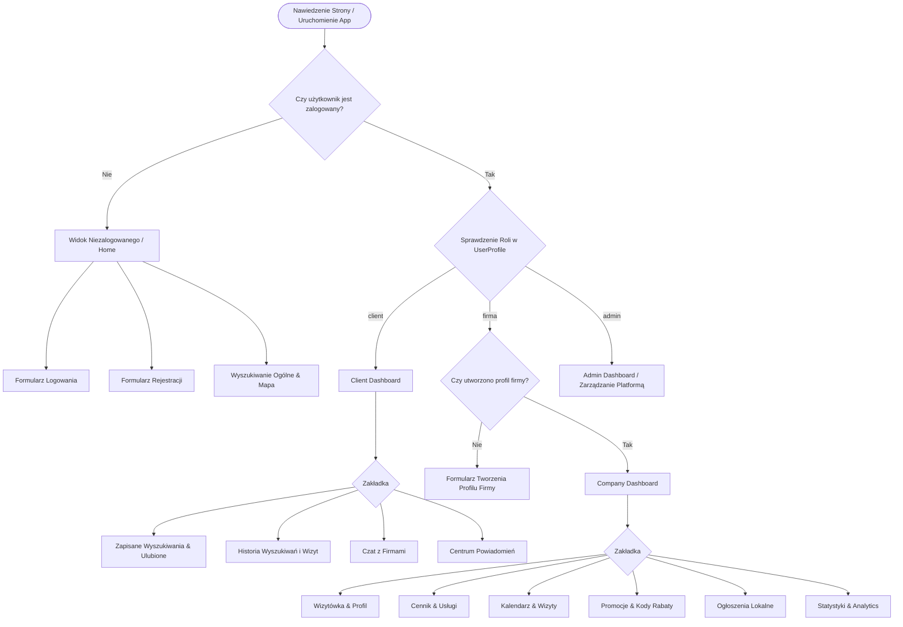
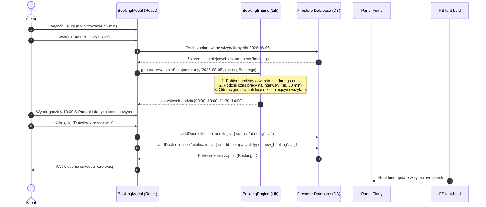

# 📱 LOKALNIE PRO — Comprehensive Architecture & Feature Specification Manual

## 📌 1. Executive Summary & Vision

**LOKALNIE PRO** to nowoczesna, wysoce skalowalna platforma marketplace ukierunkowana na usługi lokalne. Aplikacja łączy użytkowników poszukujących profesjonalnych usług (od fryzjerów i mechaników, po hydraulików i korepetytorów) z lokalnymi dostawcami i firmami.

Projekt został zaprojektowany z myślą o najwyższej jakości kodu, pełnej responsywności (RWD), bezbłędnej integracji z **Firebase (Authentication, Firestore Database, Analytics)** oraz zaawansowanych algorytmach optymalizacji i rankingu (bez użycia zewnętrznych modeli AI).

---

## 🏗️ 2. Struktura Projektu i Architektura Plików

Aplikacja opiera się na strukturze modułowej. Każda domena biznesowa posiada swój dedykowany katalog w `src/components/` oraz warstwę logiki w `src/lib/`.

```
stwurz-auth/
├── assets/                       # Statyczne zasoby graficzne i ikony
├── public/                       # Zasoby publiczne PWA i webmanifest
├── src/
│   ├── components/               # Komponenty UI i widoki aplikacji
│   │   ├── auth/                 # Moduł Uwierzytelniania i Konta Użytkownika
│   │   │   ├── LoginForm.tsx            # Formularz logowania (Email/Password & Socials)
│   │   │   ├── RegisterForm.tsx         # Rejestracja z wyborem roli (Klient / Firma)
│   │   │   └── ForgotPasswordForm.tsx   # Resetowanie hasła i weryfikacja email
│   │   ├── booking/              # Moduł Kalendarza i Rezerwacji Wizyt
│   │   │   ├── BookingModal.tsx         # Interaktywny modal rezerwacji wizyty dla klienta
│   │   │   └── CompanyBookings.tsx      # Panel zarządzania wizytami dla przedsiębiorcy
│   │   ├── chat/                 # Komunikator Real-Time
│   │   │   ├── ChatWindow.tsx           # Okno czatu z historią i wysyłaniem wiadomości
│   │   │   └── ChatList.tsx             # Lista aktywnych konwersacji i wskaźniki unread
│   │   ├── client/               # Panel Klienta (Mieszkańca)
│   │   │   ├── ClientDashboard.tsx      # Główny dashboard klienta (nawigacja, zakłady)
│   │   │   ├── ClientFavorites.tsx      # Zarządzanie ulubionymi firmami i słowami kluczowymi
│   │   │   └── ClientHistory.tsx        # Historia wyszukiwań, rezerwacji i przeglądanych profili
│   │   ├── company/              # Panel Biznesowy (Przedsiębiorca)
│   │   │   ├── CompanyDashboard.tsx     # Główny pulpit nawigacyjny firmy
│   │   │   ├── CompanyProfile.tsx       # Podgląd profilu i edycja informacji podstawowych
│   │   │   ├── CompanyProfileForm.tsx   # Kreator/edytor pełnego profilu firmy
│   │   │   ├── CompanyPublicProfile.tsx # Publiczna wizytówka widoczna dla klientów
│   │   │   ├── CompanyServices.tsx      # Zarządzanie cennikiem i czasem trwania usług
│   │   │   ├── CompanyPromotions.tsx    # Moduł kodów rabatowych i promocji
│   │   │   ├── CompanyAds.tsx           # Zarządzanie ogłoszeniami lokalnymi
│   │   │   ├── CompanyStatistics.tsx    # Analityka wyświetleń, kliknięć i konwersji
│   │   │   └── CompanyVisibility.tsx    # Pakiety promocyjne (Free, Silver, Gold, Platinum)
│   │   ├── common/               # Komponenty Wspólne i Nawigacja
│   │   │   ├── Navbar.tsx               # Główny pasek nawigacji serwisu
│   │   │   ├── Sidebar.tsx              # Uniwersalne boczne menu nawigacyjne z Dark Mode
│   │   │   ├── SearchBar.tsx            # Pasek wyszukiwania z autouzupełnianiem
│   │   │   └── SearchMap.tsx            # Geomapa z pinezkami firm i podglądem popup
│   │   ├── reviews/              # System Opinii i Recenzji
│   │   │   ├── ReviewsList.tsx          # Wyświetlanie opinii z odpowiedziami firmy
│   │   │   └── AddReviewModal.tsx       # Formularz oceniania (1-5 gwiazdek + opis)
│   │   └── ui/                   # Atomowy Design System UI
│   │       ├── Toast.tsx                # System powiadomień Toast (Sukces, Błąd, Info)
│   │       ├── Modal.tsx                # Reużywalny modal ze szklanym tłem (Glassmorphism)
│   │       └── Badge.tsx                # Etykiety statusów i kategorii
│   ├── lib/                      # Core Engines & Logic (Warstwa Usługowa)
│   │   ├── firebase.ts               # Inicjalizacja i konfiguracja Firebase App, Auth i Firestore
│   │   ├── AuthContext.tsx            # React Context dla sesji użytkownika i ról (RBAC)
│   │   ├── SearchEngine.ts            # Wyszukiwanie wielokryterialne i sugestie autocomplete
│   │   ├── RankingEngine.ts           # Algorytm punktacji i pozycjonowania wyników
│   │   ├── BookingEngine.ts           # Logika rezerwacji, sloty czasowe i blokowanie kolizji
│   │   ├── ChatEngine.ts              # Obsługa subskrypcji wiadomości Firestore onSnapshot
│   │   ├── NotificationEngine.ts      # Generowanie i push powiadomień systemowych
│   │   ├── AnalyticsEngine.ts         # Śledzenie statystyk profilu i konwersji
│   │   ├── useLocalStorage.ts         # Custom Hook do trwałego przechowywania w przeglądarce
│   │   └── useToast.ts                # Custom Hook do zarządzania komunikatami Toast
│   ├── types.ts                  # Pełne definicje interfejsów TypeScript
│   ├── App.tsx                   # Główny menedżer widoków i routing stanowy
│   ├── main.tsx                  # Punkt wejścia aplikacji
│   └── index.css                 # Globalny arkusz stylów, CSS Variables & Tailwind Directives
├── firebase-blueprint.json       # Schemat kolekcji Firestore i struktura dokumentów
├── firestore.rules               # Reguły bezpieczeństwa dostępu do Firestore
├── package.json
└── vite.config.ts
```

---

## 📐 3. Kompletne Diagramy Architektury i Przepływu Danych

### 🔄 3.1. Przepływ Nawigacji i Kontrola Uprawnień (User Flow & Role Control)



---

### 🗓️ 3.2. Szczegółowy Diagram Sekwencji Rezerwacji Wizyty



---

## ⚡ 4. Głęboka Analiza Wszystkich Modułów i Algorytmów

### 👤 4.1. Moduł Profilu Użytkownika i Rozbudowanego Profilu Firmy

Profil firmy w **LOKALNIE PRO** to bogata wizytówka biznesowa.

#### Kluczowe Komponenty Profilu Firmy:
1. **Tożsamość Wizualna**: Logo firmy, Zdjęcie Główne (Hero Image) oraz Galeria Realizacji (z możliwością dynamicznego dodawania/usuwania zdjęć).
2. **Sekcja Informacji Działalności**: Rok założenia, zakres usług, obszar działania (miasto + promień km), dane adresowe i lokalizacja geograficzna (`lat`, `lng`).
3. **Harmonogram Pracy (Opening Hours)**: Dedykowane godziny otwarcia dla każdego dnia tygodnia (np. `08:00 - 16:00` lub `Zamknięte`).
4. **Kanały Social Media & Web**: Bezpośrednie linki do strony WWW, Instagrama, Facebooka oraz TikToka.
5. **Sekcja FAQ**: Pytania i odpowiedzi ułatwiające klientom podjęcie decyzji przed kontaktowaniem się.

#### 📊 Algorytm Wskaźnika Kompletności Profilu (Profile Completeness Indicator)
Funkcja `calculateProfileCompleteness(company: Company)` dokonuje oceny jakości wizytówki w skali od **0% do 100%** (skalowanej do max 20 punktów rankingowych):

$$\text{Completeness Score} = \frac{\sum_{i=1}^{n} w_i}{\text{Total Max Points}} \times 100\%$$

* **Wypełnienie pól podstawowych** (Logo, Zdjęcie główne, Opis, Telefon, Email, Website): $+1\text{ pkt}$ za każde pole.
* **Harmonogram pracy**: $+1\text{ pkt}$.
* **Social Media**: $+0.5\text{ pkt}$ za każdą sieć (Max $+1.5\text{ pkt}$).
* **Zdjęcie zespołu / Certyfikaty**: $+1\text{ pkt}$.
* **Sekcja FAQ**: $+0.5\text{ pkt}$.
* **Aktywny system rezerwacji online**: $+1\text{ pkt}$.

---

### 🔍 4.2. Wyszukiwarka, Smart Auto-complete & Filtrowanie

#### 🧠 Smart Auto-complete Engine
Podczas wpisywania frazy w komponent `SearchBar.tsx`, silnik przeszukuje zgromadzoną bazę indeksów usług i nazw firm, natychmiastowo zwracając podpowiedzi w podziale na 4 kategorie:
- **Sugerowane Firmy** (np. *Auto Serwis Kowalski*)
- **Kategorie** (np. *Fryzjer & Barber*, *Hydraulika*)
- **Dedykowane Usługi** (np. *Wymiana klocków hamulcowych*)
- **Sugerowane Lokalizacje** (np. *Poznań - Stare Miasto*)

#### 🔍 Kryteria Filtrowania & Sortowania
- **Weryfikacja Odległości**: Obliczanie dystansu na podstawie współrzędnych GPS klienta oraz firmy z użyciem wzoru Haversine:
  $$d = 2R \cdot \arcsin\left(\sqrt{\sin^2\left(\frac{\Delta \phi}{2}\right) + \cos(\phi_1)\cos(\phi_2)\sin^2\left(\frac{\Delta \lambda}{2}\right)}\right)$$
- **Filtrowanie cenowe**: Od najtańszych do najdroższych usług.
- **Filtrowanie ocen**: Wyświetlanie firm ze średnią ocen wyższą niż np. 4.0 lub 4.5.

---

### 🏆 4.3. Inteligentny Silnik Rankingu Firm (RankingEngine)

Pozycjonowanie firm na liście wyników wyszukiwania bazuje na precyzyjnym algorytmie punktowym.

#### Matemtyczny Model Punktacji (Total Ranking Score):

$$\text{Score} = S_{\text{Text}} + S_{\text{Semantic}} + S_{\text{Geo}} + S_{\text{Completeness}} + S_{\text{Freshness}} + S_{\text{Rating}} + S_{\text{Visibility}} + S_{\text{Bonus}}$$

| Składnik Algorytmu | Waga / Punkty | Opis Warunku |
| :--- | :--- | :--- |
| **$S_{\text{Text}}$ (Trafność Tekstowa)** | $0 - 40\text{ pkt}$ | Dopasowanie słowa kluczowego do nazwy firmy, tytułu usługi lub opisu. |
| **$S_{\text{Semantic}}$ (Kategoria)** | $0 - 25\text{ pkt}$ | Zgodność wybranej kategorii i miasta z filtrem użytkownika. |
| **$S_{\text{Geo}}$ (Geolokalizacja)** | $1 - 20\text{ pkt}$ | $<2\text{ km} \rightarrow 20\text{ pkt}$, $<5\text{ km} \rightarrow 15\text{ pkt}$, $<10\text{ km} \rightarrow 10\text{ pkt}$. |
| **$S_{\text{Completeness}}$** | $0 - 20\text{ pkt}$ | Punkty przyznawane na podstawie stopnia wypełnienia profilu. |
| **$S_{\text{Freshness}}$ (Aktywność)** | $1 - 10\text{ pkt}$ | Aktualizacja danych firmy: $\le 7\text{ dni} \rightarrow 10\text{ pkt}$, $\le 30\text{ dni} \rightarrow 7\text{ pkt}$. |
| **$S_{\text{Rating}}$ (Oceny)** | $0 - 10\text{ pkt}$ | Przelicznik średniej gwiazdek: $(\text{Rating} / 5) \times 10$. |
| **$S_{\text{Visibility}}$ (Pakiety Promocji)**| $0 - 500\text{ pkt}$ | Platinum ($+500\text{ pkt}$ - Top 1), Gold ($+150\text{ pkt}$), Silver ($+50\text{ pkt}$). |
| **$S_{\text{Bonus}}$ (Extra Udogodnienia)**| $0 - 25\text{ pkt}$ | Posiadanie certyfikatów ($+15\text{ pkt}$), włączona rezerwacja online ($+10\text{ pkt}$). |

---

### 📅 4.4. System Rezerwacji Wizyt (Booking Engine)

System rezerwacji w **LOKALNIE PRO** zapewnia pełną kontrolę nad kalendarzem wizyt bez ryzyka podwójnej rezerwacji (double booking).

#### Funkcje Logiczne `BookingEngine.ts`:
1. **`checkSlotConflict(existingBookings, date, time)`**: Weryfikuje, czy dla danej daty i godziny nie istnieje już zaakceptowana lub oczekująca wizyta.
2. **`generateAvailableSlots(company, dateStr, existingBookings)`**:
   - Odczytuje dni i godziny pracy dla wskazanego dnia tygodnia.
   - Generuje pełną listę przedziałów czasowych (np. co 30 minut).
   - Filtruje minione godziny (dla dnia dzisiejszego).
   - Odrzuca godziny objęte konfliktami z bazą Firestore.

#### Life-Cycle Rezerwacji (Status Management):
- `pending`: Wizyta zarezerwowana przez klienta, czeka na akceptację przedsiębiorcy.
- `confirmed`: Wizyta zaakceptowana przez firmę (powiadomienie push/email dla klienta).
- `completed`: Wizyta sfinalizowana (odblokowuje klientowi opcję wystawienia opinii).
- `cancelled`: Wizyta anulowana przez klienta lub odrzucona przez firmę.

---

### 💬 4.5. Real-Time Chat & Notification System

#### Komunikator Real-Time (`ChatEngine.ts`)
- **Architektura**: Oparta na natywnych subskrypcjach WebSocket przez `onSnapshot` z Firebase Firestore.
- **Funkcjonalności**:
  - Prowadzenie dyskusji w czasie rzeczywistym między klientem a firmą.
  - Automatyczne oznaczanie wiadomości jako przeczytane (`read: true`) w momencie otwarcia wątku.
  - Wskaźniki nieprzeczytanych wiadomości (Badge counter) w nawigacji i Sidebarze.

#### Centrum Powiadomień (`NotificationEngine.ts`)
Powiadomienia generowane są automatycznie w reakcji na kluczowe zdarzenia w aplikacji:
- **Powiadomienia dla Klienta**: Nowa wiadomość od firmy, zmiana statusu rezerwacji wizyty, informacja o nowej promocji w zaobserwowanej kategorii.
- **Powiadomienia dla Firmy**: Nowe zapytanie od klienta, nowa rezerwacja wizyty w kalendarzu, nowa opinia i ocena.

---

### 💰 4.6. Narzędzia Biznesowe i Analityka Firmy (Company Suite)

#### 1. Promocje i Kody Rabatowe (`CompanyPromotions.tsx`)
Firmy mogą w prosty sposób tworzyć oferty promocyjne:
- Tytuł promocji i opis rabatu (np. `-20% na pierwszą wizytę`).
- Generowanie unikalnego kodu promocyjnego (np. `LATO2026`).
- Ustawianie daty wygaśnięcia promocji.

#### 2. Ogłoszenia Lokalne (`CompanyAds.tsx`)
Publikacja ogłoszeń w celach pozyskiwania nowych klientów w okolicy z podglądem liczby wyświetleń i opcją szybkiej aktywacji/dezaktywacji.

#### 3. Panel Statystyk i Analityki (`CompanyStatistics.tsx`)
Monitorowanie statystyk w czasie rzeczywistym:
- Liczba wyświetleń wizytówki firmy.
- Liczba kliknięć przycisku kontaktowego (Telefon / Email / WWW).
- Liczba złożonych rezerwacji oraz zapytań na czacie.
- Analiza najpopularniejszych usług z cennika.

---

### ⭐ 4.7. System Opinii i Moderacji (Review System)

- **Dodawanie Oceny**: Klienci po sfinalizowaniu usługi mogą dodać ocenę w skali **1 do 5 gwiazdek** oraz komentarz.
- **Odpowiedzi Firmy**: Przedsiębiorca posiada możliwość oficjalnego ustosunkowania się do opinii i zamieszczenia odpowiedzi pod recenzją.
- **Filtrowanie i Sortowanie**: Sortowanie opinii od najnowszych, z najwyższą oceną oraz najniższą oceną.

---

## 📊 5. Pełna Dokumentacja Modelu Danych (Firestore Schemas)

### Kolekcja `users`
```typescript
interface UserProfile {
  uid: string;
  email: string;
  name: string;
  role: 'client' | 'firma' | 'admin';
  createdAt: string;
  location?: {
    lat: number;
    lng: number;
    city: string;
  };
}
```

### Kolekcja `companies`
```typescript
interface Company {
  uid: string; // Odpowiada user.uid
  companyName: string;
  nip: string;
  description: string;
  address: string;
  city: string;
  postalCode: string;
  phone: string;
  email: string;
  website?: string;
  services: string;
  logo?: string;
  mainPhoto?: string;
  gallery?: string[];
  lat: number;
  lng: number;
  openingHours?: {
    [day: string]: string; // np. "08:00 - 16:00"
  };
  visibilityPackage: 'free' | 'silver' | 'gold' | 'platinum';
  workingArea?: string;
  rating?: number;
  reviewCount?: number;
  updatedAt: string;
  foundedYear?: number;
  bookingEnabled?: boolean;
  bookingUrl?: string;
  languages?: string[];
  paymentMethods?: string[];
  amenities?: string[];
  faqs?: Array<{ question: string; answer: string }>;
  instagram?: string;
  facebook?: string;
  tiktok?: string;
  teamPhoto?: string;
  certificates?: string[];
}
```

### Kolekcja `bookings`
```typescript
interface Booking {
  id: string;
  companyId: string;
  companyName: string;
  clientId: string;
  clientName: string;
  clientPhone: string;
  serviceId: string;
  serviceName: string;
  price: number;
  date: string; // YYYY-MM-DD
  time: string; // HH:MM
  durationMin: number;
  status: 'pending' | 'confirmed' | 'completed' | 'cancelled';
  createdAt: string;
}
```

### Kolekcja `messages`
```typescript
interface Message {
  id: string;
  senderId: string;
  receiverId: string;
  senderName: string;
  content: string;
  timestamp: string;
  read: boolean;
}
```

### Kolekcja `notifications`
```typescript
interface Notification {
  id: string;
  userId: string;
  title: string;
  content: string;
  read: boolean;
  createdAt: string;
  type: 'message' | 'review' | 'promotion' | 'ad_expiry' | 'system';
}
```

---

## 🛠️ 6. Wytyczne Produkcyjne i Uruchomieniowe

### Uruchomienie Środowiska Lokalnego:
```bash
# 1. Instalacja pakietów z npm
npm install

# 2. Uruchomienie serwera deweloperskiego Vite
npm run dev
```

### Budowanie Wersji Produkcyjnej (Build & Preview):
```bash
# Kompilacja projektu TypeScript do dist/
npm run build

# Podgląd zbudowanej aplikacji produkcyjnej
npm run preview
```
